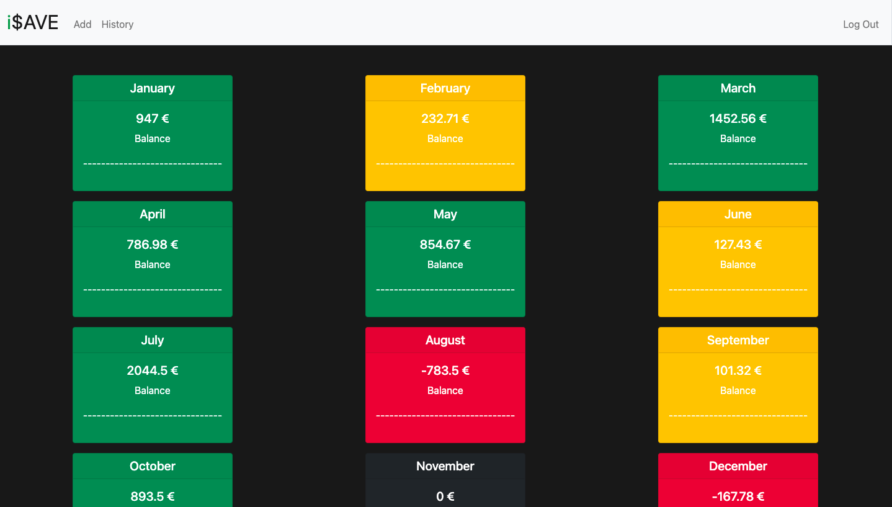

# i$AVE

## Video Demo:  <https://www.youtube.com/watch?v=1a9KTklr4Xo>

## Description:

Hello, my name is Bruno Januário, and iSave is my final project for the CS50 course.

I wanted to create an application that could be useful to me on a daily basis, hence the idea of ​​creating an application where I could control my savings and expenses.
That's when iSave emerged, allowing us to do all this and create our savings target and have a view of every month of the year on how our finances are about the target.

To build my application I used HTML and CSS for the front end and python for the back end. back endask's help of Flask, I built my server-side and Django allowed me to manipulate the HTML with the information I was sending.

<ins>app.py:</ins>

Here is where all the logic of being-side is found.
With the help of Flask, we are listening to HTTP requests and sending the corresponding response.
With the Session imported from flask_session, persist the user's information even if he jumps from page to page in our application.
Here we also interact with the database to make requests and queries to obtain information from customers.

<ins>project.db:</ins>

The file of our database was created using SQLite, where we persist all the information of our customers.
It consists of only two tables, one called "users" where a different id is assigned to each one when they are created, and where the information of the "username", "password" and the target for savings is stored.
In the other table, we have all the transactions of the users, where we store the user's id, the amount of money, the date, and the type of expense.

<ins>template/index.html:</ins>

The main page of our application can only be accessed if we have logged in, otherwise we are redirected to the login page.
Here we have a view of all the months of the year and the balance of our savings in those same months, information that is passed to us through Flask and that thus manipulates the amounts of each month depending on the user who is connected. It is also possible to change our savings target at the bottom of the page.
This target influences the color of each month's cards. If the balance is greater than or equal to the target, the card is green, if it is less, it is yellow, if the balance is equal to 0, it is black and if it is negative, it is red.

<ins>template/layout.html:</ins>

The layout is a file that allows you to reduce the code in all other html files with the help of Django.
So I have concentrated in a single file all the code that creates the nav bar and footer. The nav bar is different depending on whether the user is already logged in or not, that is, if he has not yet done so, only the login and register options will appear in the nav bar, but if he has already done so these options disappear and show the "add", "history" and "logout" options.

<ins>template/login.html:</ins>

On this page we have the login which is basically a form where the user has to put the username and password, then a request post is sent to the server to make the checks.

<ins>template/register.html:</ins>

On this page, we have the form for when the user wants to register, being necessary to provide username, password, and password confirmation.
This form sends a POST request with the information that is verified on the server side.

<ins>template/add.html:</ins>

This is the file that contains the form that allows us to add amounts to our finances. In the form we have to enter the amount, the date, and the type of expense. This information is sent by POST request to the server.

<ins>template/apology.html:</ins>

Here is what appears to the user if he does something wrong.
The page consists of a photo of a funny dog and a message with the error that is handled by Django through the information sent by the server.

<ins>template/history.html:</ins>

File that consists of a table with the columns "expense type", "amount" and "date", where all transactions that the user has already made are available.
The information is all sent by the server and through Django, we create the rows with the user's data.

<ins>template/month.html:</ins>

Here, information on the amounts for each type of expense made in a given month is available.

<ins>static/style.css:</ins>

This is the file where I have all the style specifications for my application.

Throughout the project it was necessary to search for a variety of information, mainly from Django and Flask.
My choices for the software design were all based on what I learned during the course.
It was super good to do this project and I was happy with the final result, because it was possible to put into practice a lot of content that we gave in the course and I created an application that will be useful to me if I want to use it.

This is CS50!
